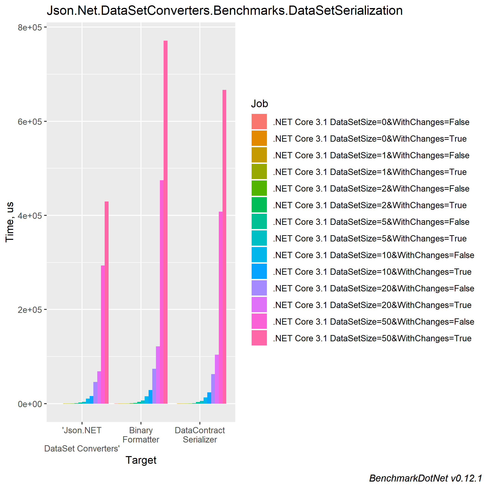
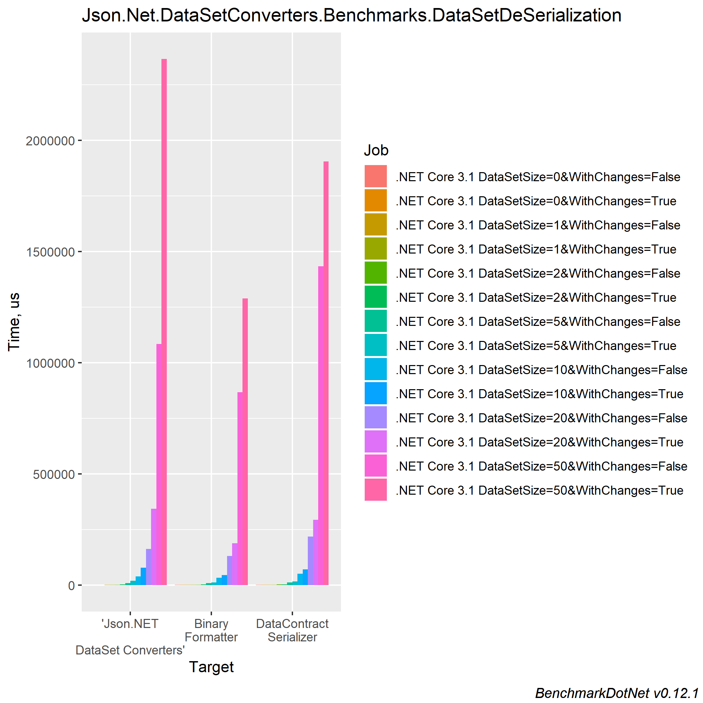

# [Json.NET](https://github.com/JamesNK/Newtonsoft.Json) DataSet [converters](https://www.newtonsoft.com/json/help/html/SerializationSettings.htm#Converters)

[](https://dev.azure.com/AlesDo/Json.NET%20DataSet%20Converters/_build/latest?definitionId=1&branchName=master)


DataSet [converters](https://www.newtonsoft.com/json/help/html/SerializationSettings.htm#Converters) for [Json.NET](https://github.com/JamesNK/Newtonsoft.Json) that provide full serialization for [DataSet](https://docs.microsoft.com/en-us/dotnet/api/system.data.dataset?view=netstandard-2.0)s and [DataTable](https://docs.microsoft.com/en-us/dotnet/api/system.data.datatable?view=netstandard-2.0)s. 
They preserve all the state like the serialization built in the standard .NET serializers. 
This enables the use of JSON serialization for all scenarios where DataSets or DataTables are used.
Since all the state is preserved it is more data heavy and should be used only when this is required.

## Why this is useful

The idea for this came of a need to modernize old WCF and ASMX web services to modern ASP.NET Core WebAPI services without the need to completely rewrite everything on the server and client side in cases where DataSets have been used to send the data to clients. This way a slow transition from older technologies to using the latest is possible. It is especially useful with .NET Core 3 that brings also WinForms and WPF client applications and you can completely move the whole stack into .NET Core. 

## How to use

The simplest way to use the converters is to add them to the json serializer default settings. This way they will override the built in converters and will always be used.

```csharp
JsonConvert.DefaultSettings = () => new JsonSerializerSettings()
{
    Converters = new List<JsonConverter>() { new Json.Net.DataSetConverters.DataSetConverter(), new Json.Net.DataSetConverters.DataTableConverter() }
};
```

If you are using them only in specific cases you can specify the converter to use directly when you serialize or deserialize an object.

```csharp
string serializedDataSet = JsonConvert.SerializeObject(dataSet, new Json.Net.DataSetConverters.DataSetConverter());
DataSet deserializedDataSet = JsonConvert.DeserializeObject<DataSet>(serializedDataSet, new Json.Net.DataSetConverters.DataSetConverter());

string serializedDataTable = JsonConvert.SerializeObject(dataTable, new Json.Net.DataSetConverters.DataTableConverter());
DataSet deserializedDataTable = JsonConvert.DeserializeObject<DataTable>(serializedDataTable, new Json.Net.DataSetConverters.DataTableConverter());
```

### In ASP.NET Core

To use the converters in an ASP.NET Core applications you need to set the converters in Startup file of the application when you add MVC services.

### ASP.NET Core 2.0

```csharp
services.AddMvc().AddJsonOptions((jsonOptions) => 
{
   jsonOptions.SerializerSettings.Converters.Add(new Json.Net.DataSetConverters.DataTableConverter());
   jsonOptions.SerializerSettings.Converters.Add(new Json.Net.DataSetConverters.DataSetConverter());
});
```

### ASP.NET Core 3.0

```csharp
services.AddControllers().AddNewtonsoftJson((jsonOptions) => 
{
   jsonOptions.SerializerSettings.Converters.Add(new Json.Net.DataSetConverters.DataTableConverter());
   jsonOptions.SerializerSettings.Converters.Add(new Json.Net.DataSetConverters.DataSetConverter());
});
```

Check also the [samples solution](https://github.com/AlesDo/DataSetConverters/tree/master/Json.Net.DataSetConverters.Samples) for a working example of a Windows Forms application taking to an ASP.NET Core WebApi.

### Using Object types in columns

The serialization supports also an Object or custom object column type as long as it can be serialized to JSON.
When using custom types if you have the same type available on the deserialization side it will be automatically deserialized to the same type. If the same type cannot be found it will deserialize as a [JObject](https://www.newtonsoft.com/json/help/html/T_Newtonsoft_Json_Linq_JObject.htm).

### Using Object types in Extended properties

You can use any type as the key or value in an extended property. Like for columns it will deserialize to the same type if the type can be found on the deserialization side. Else it is deserialized as a [JObject](https://www.newtonsoft.com/json/help/html/T_Newtonsoft_Json_Linq_JObject.htm).

## Performance

Performance measurements show that the serialization speed is better than the `BinaryFormater` and `DataContractSerializer` serialization.

In the chart below are the results of benchmarking the `DataSet` serialization. The DataSetSize is the number of rows in the main database tables. The test data set consists of 6 tables two of them have the number of row same as the size. The other tables that are related get 10 rows for each parent row. For size 10 there are two tables with 10 rows and 4 tables with 100 rows. The WithChanges parameter means if the data set had changes when it was serialized or not. When there are changes more data has to be serialized to have also all the original values. The DataSet with changes has changes in half of the rows.



[Click here for detailed serialization performance results](Json.Net.DataSetConverters.Benchmarks.DataSetSerialization-report-github.md).

In the following chart are the results for deserialization. Here it is visible that for big DataSets with changes the performance starts to fall behind the `BinaryFormater` and `DataContractSerializer` serialization.



[Click here for detailed deserialization performance results](Json.Net.DataSetConverters.Benchmarks.DataSetDeSerialization-barplot.png).

## Why F#

To learn and experiment with it and see how it interoperates with C# code. 